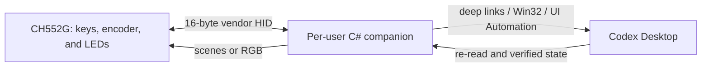

# CodexKeyboard

Hardware controller for Codex Desktop based on the AliExpress USB mini keyboard with a CH552G microcontroller, three keys, a pressable rotary encoder, and three addressable RGB LEDs.

The project completely replaces the stock firmware and uses an almost invisible Windows companion to translate physical events into verified Codex Desktop actions and report state through the LEDs.

> Last updated: July 17, 2026 — Phase: R0/R1 complete; R2 first baseline flash next

## Goal

- control Codex Desktop with three keys and a knob;
- change the effort of the visible task without modifying the global default;
- show only verified Codex states on the three RGB LEDs;
- install no drivers, require no administrator privileges, and show no permanent windows;
- keep the firmware, companion, and protocol small and testable.

## Current decisions

| Area | Decision |
|---|---|
| Firmware | Minimal fork of [`eccherda/ch552g_mini_keyboard`](https://github.com/eccherda/ch552g_mini_keyboard), replacing keyboard/mouse macros with the CodexKeyboard protocol. |
| USB | One bidirectional vendor-defined HID collection. The device emits no global keystrokes and requires no custom driver. |
| LEDs | The companion sends a state or RGB frame; effects and animations run locally in the firmware. |
| Companion | Per-user C# Windows application, built as `WinExe`, with no console or main window and only a tray icon for status, diagnostics, and exit. |
| Startup | Per-user autostart; same interactive desktop and integrity level as Codex, without elevation. |
| Codex control | Official deep links where available, native Windows APIs, and semantic UI Automation with postcondition verification. |
| App server | No second app server is started to control the task owned by Codex Desktop. |
| Configuration | v1 does not modify `config.toml` and introduces no mapping editor, database, or plugin system. |

## Architecture



### Where state lives

| State | Source of truth |
|---|---|
| Press, release, and encoder detent | Firmware, after debouncing and quadrature decoding. |
| Effect and RGB frame actually displayed | Firmware. |
| Mapping of the six actions and desired LED scene | Companion. |
| Current task effort and state | Codex UI re-read through UI Automation. |
| Global default | `config.toml`, which CodexKeyboard does not modify. |
| Last applied USB command | Firmware ACK with sequence number. |

The companion does not keep a copy of the effort and treat it as authoritative: it reads Codex before the action and verifies the result afterward. The LEDs change state only after that verification.

## Hardware and upstream firmware

The upstream source was inspected at commit [`060bd13496e8ebd6a94029db8089b1544203c57a`](https://github.com/eccherda/ch552g_mini_keyboard/commit/060bd13496e8ebd6a94029db8089b1544203c57a), dated November 16, 2023. The repository publishes no releases.

The user confirmed that the physical keyboard is visually identical to the keyboard and PCB shown in the upstream photographs. Subsequent physical checks confirmed the ambiguous button pins and access to the `R12` bootloader pads.

### Elements confirmed by the source code

- CH552G;
- three mechanical push buttons;
- encoder with clockwise rotation, counterclockwise rotation, and press;
- three addressable RGB/GRB pixels chained on `P3.4`;
- full-speed USB through ch55xduino;
- Interrupt IN and OUT endpoints already present, currently 9 bytes;
- upstream firmware configured as a keyboard/mouse HID device;
- OUT handler present but empty: this is the smallest extension point for receiving LED commands.

### Verified pinout

| Signal | Upstream README | Upstream source | Status |
|---|---:|---:|---|
| Button 1 | `P1.6` | `P1.1` | Verified by physical continuity: `P1.1` |
| Button 2 | `P1.7` | `P1.7` | Consistent |
| Button 3 | `P1.1` | `P1.6` | Verified by physical continuity: `P1.6` |
| Encoder press | `P3.3` | `P3.3` | Consistent |
| Encoder A | `P3.1` | `P3.1` | Consistent |
| Encoder B | `P3.0` | `P3.0` | Consistent |
| LED data | `P3.4` | `P3.4` | Consistent |

Button 1 and Button 3 are swapped between the upstream documentation and source code. The user's physical continuity measurements confirm that the source code matches the device: Button 1 is on `P1.1` and Button 3 is on `P1.6`.

### Reproducible baseline build

The maintained baseline is in [`firmware/CodexKeyboard`](firmware/CodexKeyboard), derived from the pinned upstream commit with its license and attribution preserved. The sketch was renamed, non-English comments were translated, and trailing whitespace was removed; the compiled firmware is unchanged.

Pinned toolchain:

- Arduino CLI `0.35.2`; Windows x64 archive SHA-256 `831e71e91cda08071599a570fb40937c9cf0f0e8cf7711a7e24c7ee28b5406a7`;
- ch55xduino `0.0.20`; core archive SHA-256 `bcc0961c6261ab55d74fb04bdb873dd7cee853d46b6113c887068fd90b3d5efe`;
- transitive tools `MCS51Tools 2023.10.10` and SDCC `build.13407_4`;
- FQBN `CH55xDuino:mcs51:ch552:usb_settings=user148,upload_method=usb,clock=16internal,bootloader_pin=p36`.

Run from the repository root:

```powershell
pwsh -File .\Build-Firmware.ps1
```

The script verifies the Arduino CLI download, installs the pinned core into ignored repository-local directories, performs a clean command-line build, and produces `.build/firmware/CodexKeyboard.ino.hex` without using the Arduino IDE.

R1 result on July 17, 2026:

| Measurement | Result |
|---|---:|
| Flash | 12,751 / 14,336 bytes (88%) |
| Global RAM | 612 / 876 bytes (69%); 264 bytes remain |
| HEX size | 36,149 bytes |
| HEX SHA-256 | `4e7b2a73f17d8e882c9a109b40582de121a3a6c06a55bc873999bb92573acdb8` |

The renamed maintained baseline and the pinned upstream snapshot produce byte-for-byte identical HEX files. The core emits repeated `Multiple definition of _dummy_variable` diagnostics but exits successfully; no warning was hidden or patched locally.

### Bootloader and blast radius

The first flash replaces the stock firmware. The upstream project documents:

1. first bootloader entry by shorting `R12` while connecting the device to USB;
2. after the first flash, entry by holding the knob while connecting the device;
3. during operation, entry by pressing all three keys and the knob at the same time.

Before the first flash, both the build and a proven recovery procedure must work. The original `1189:8890` VID/PID belongs to the stock firmware and will no longer describe the custom device.

## CodexKeyboard firmware

v1 removes configurations, automatic macros, mouse emulation, and generic keyboard emulation. Only these parts remain:

- scanning the four push buttons;
- decoding the encoder;
- controlling the three RGB LEDs;
- bootloader recovery;
- bidirectional HID transport.

### Physical events

The firmware sends primitive events, not Codex actions:

- press/release for Button 1, Button 2, Button 3, and the knob;
- `-1` or `+1` step for each valid encoder detent.

Long press, double-click, and application mapping stay in the companion. This avoids reflashing the keyboard when behavior changes.

The upstream loop waits 5 ms but does not implement true stable debouncing. v1 must add verifiable time-based debouncing and a calibration constant for encoder transitions per detent.

### HID protocol — v1 draft

Fixed 16-byte reports, including the report ID:

| Byte | Content |
|---:|---|
| 0 | Report ID |
| 1 | Protocol version |
| 2 | Message type |
| 3 | Sequence number |
| 4-15 | Message-specific payload |

Device-to-host messages:

- `INPUT_EVENT`;
- `DEVICE_INFO` with firmware version and capabilities;
- `ACK`/`ERROR` for the received sequence number.

Host-to-device messages:

- `GET_INFO`;
- `SET_SCENE` for semantic state and a local effect;
- `SET_RGB` to set the three pixels directly;
- `PING` to detect the real presence of the companion.

No application checksum is needed because USB already provides error checking. The sequence number connects a command to its ACK; it does not make the transport reliable.

Inputs use a small bounded queue and report any overflow. LED commands are last-write-wins. Exact values, enums, and timeouts become final only together with the first automated protocol codec test.

### LED strategy

The PC does not continuously stream animation frames. It sends a scene when state changes, and the CH552G animates it locally at a limited rate. This keeps USB input independent from LED rendering.

| Scene | Source | Status |
|---|---|---:|
| Boot / bootloader | Firmware | Supported upstream |
| Companion absent | Heartbeat timeout | To implement |
| Companion connected | HID handshake | To implement |
| Codex unavailable | Window/process lookup | To implement |
| Medium / High / Ultra effort | Verified UIA state | Technique already tested |
| Action succeeded / failed | UIA postcondition | To implement |
| Turn active / waiting for approval / completed | Semantic UIA anchors | Must be tested before use |

Colors, brightness, and speed are not fixed yet and must be calibrated on the real device. The firmware must always enforce a maximum brightness limit.

## Windows companion

### Process shape

The companion will be a small per-user application:

- `WinExe` output with no console;
- no main window or taskbar presence;
- a single instance;
- tray icon with status, reconnect, diagnostics, and exit;
- optional autostart for the current user;
- no Windows Service, driver, administrator privileges, or `uiAccess`.

A Windows Service is unsuitable because it would be isolated in Session 0, while controlling Codex must happen in the user's desktop session.

### Dependencies

The first version uses only .NET and native Windows APIs:

- WinForms for the message loop and tray icon;
- SetupAPI/HID for enumeration, hot-plug, and USB reports;
- `FileStream`/overlapped I/O on the device path;
- Win32 for finding and activating the window;
- Windows UI Automation for Codex controls.

Avalonia, MVVM, a database, a local web server, and external HID libraries are not planned while native APIs cover the use case.

### Controlling Codex Desktop

Control surfaces are used in this order:

1. official deep links such as `codex://threads/new` and `codex://threads/<thread-id>`;
2. Win32 APIs to find, restore, and activate the window;
3. UI Automation using control type, hierarchy, patterns, and current text;
4. postcondition verification in the UI.

Mouse coordinates, OCR, dynamic `radix-*` `AutomationId` values, private sockets, and direct modification of Codex state files are not used.

During testing on the real PC, the window was found by enumerating top-level windows owned by the `ChatGPT` process: class `Chrome_WidgetWin_1`, accessible `RootWebArea` document named `Codex`. The selector exposes a `Button` containing the current model and effort, so the controller semantically finds the menu item whose name starts with `Effort`, uses the `ExpandCollapse`/`Invoke` patterns, and re-reads the button as the postcondition. Focus is requested only when needed to open the menu.

[`codex app-server`](https://github.com/openai/codex/blob/main/codex-rs/app-server/README.md) provides a complete JSON-RPC protocol for clients that own the server and conversation, but no supported way is documented for attaching the companion to the private instance already owned by Codex Desktop. Starting a second one would create a second state owner and would not control the visible task through a supported path.

### Targeting and concurrency

- v1 supports one unambiguous Codex window and acts on the visible task.
- Only one UI Automation operation may run at a time.
- Rapid knob detents are coalesced into a short burst that applies only the final target.
- If the window or task changes during an operation, the action fails without updating the LEDs as if it had succeeded.
- Codex approvals are never accepted automatically.

## Proposed v1 mapping

| Control | Action |
|---|---|
| Button 1 | Activate/restore Codex |
| Button 2 | New task through `codex://threads/new` |
| Button 3 | Stop the current turn, protected by double press or long press |
| Knob CCW | Previous effort: `Medium → High → Ultra` |
| Knob CW | Next effort: `Medium → High → Ultra` |
| Knob press | Activate Codex and show/confirm the current effort |

The UI Automation technique has already changed the visible task effort between `Ultra` and `Extra High`, verified the final value, and left `model_reasoning_effort` in `config.toml` unchanged.

## Project status

| Area | Status | Next gate |
|---|---:|---|
| Stock `1189:8890` device analysis | Completed | Remaining useful information incorporated into this README |
| Effort control through UI Automation | Tested on the real PC | Repeat after companion implementation |
| Custom firmware baseline | Imported | First baseline flash and hardware validation |
| Upstream source review | Completed | Physical Button 1/3 pinout verified |
| Vendor HID USB architecture | Defined | Freeze byte layout with a codec test |
| Hidden companion architecture | Defined | Create the minimal `WinExe` project |
| Baseline firmware build | Completed | Repeat with `pwsh -File .\Build-Firmware.ps1` |
| Device flash | Not started | Enter the bootloader through accessible `R12` and start R2 |
| Firmware/host HID protocol | Not started | Loopback and hot-plug |
| RGB scenes | Not started | Calibrate brightness and timing |
| Codex state detection | Partial | Capture UIA anchors for each state |
| End-to-end testing | Not started | One physical event equals one verified action |

## Roadmap

The roadmap is governed by verifiable gates, not dates. A phase is complete only when its exit criterion is satisfied.

```text
R0 Hardware ─┐
             ├─> R2 Baseline flash -> R3 Protocol -> R4 Firmware -> R5 HID companion
R1 Build  ───┘                                                    -> R6 Codex -> R7 LEDs -> R8 Release
```

| ID | Phase | Owner | Status |
|---|---|---|---:|
| R0 | Hardware truth and recovery | Joint | Completed |
| R1 | Reproducible firmware baseline | Codex | Completed |
| R2 | First flash and upstream validation | Joint | Next |
| R3 | HID v1 contract | Codex | Waiting for R2 |
| R4 | CodexKeyboard firmware | Codex + user testing | Waiting for R3 |
| R5 | Hidden HID companion | Codex | Waiting for R4 |
| R6 | End-to-end Codex control | Codex + user testing | Waiting for R5 |
| R7 | Verified LED feedback | Joint | Waiting for R6 |
| R8 | Packaging and v1 acceptance | Joint | Waiting for R7 |

### R0 — Hardware truth and recovery

**Operations**

- confirm that the device is visually identical to the upstream photographs (user-confirmed);
- inspect the PCB directly or through close-up photographs to identify the microcontroller marking, PCB revision, `R12`, pads, and button signal traces;
- verify Button 1/Button 3 by continuity testing (user-confirmed: Button 1 is `P1.1`, Button 3 is `P1.6`);
- confirm encoder press `P3.3`, encoder A/B `P3.1/P3.0`, and LED data `P3.4`;
- verify that the physical bootloader entry method is accessible and repeatable (user-confirmed for `R12` access).

**Evidence:** exact visual match with the upstream keyboard and PCB, physical continuity measurements for Button 1/Button 3, and accessible `R12` pads.

**Deliverable:** definitive pinout in the README and a recovery checklist.

**Exit gate:** no ambiguous pin and a physically practical bootloader procedure.

**Stop condition:** no flashing until this gate is closed.

### R1 — Reproducible firmware baseline

**Operations**

- import the pinned upstream commit into a `firmware/` directory while preserving its license and attribution;
- pin the ch55xduino toolchain version and configuration;
- compile the unchanged upstream firmware from the Windows command line;
- record the build command, flash/RAM size, and produced artifact;
- add the smallest check that rebuilds the baseline from a clean checkout.

**Deliverable:** tracked upstream source and documented build.

**Exit gate:** reproducible compilation without manual IDE changes.

**Evidence:** `pwsh -File .\Build-Firmware.ps1` completed successfully on July 17, 2026 and produced the byte-identical baseline HEX documented above.

**Note:** R0 and R1 are complete and jointly unblock R2.

### R2 — First flash and upstream validation

**Operations**

- enter the bootloader through `R12` and record the observed identifiers;
- flash the upstream baseline compiled in R1;
- verify USB enumeration, the three keys, knob press, both encoder directions, and all three RGB LEDs;
- disconnect and reconnect the device;
- re-enter the bootloader both by holding the knob during connection and by using the four-button chord.

**Deliverable:** bench record with the result for every input, LED, and recovery method.

**Exit gate:** working baseline and recovery proven after the first flash.

**Stop condition:** if recovery fails, do not modify the USB stack yet.

### R3 — HID v1 contract

**Operations**

- freeze report IDs, enums, payloads, sequence number, capabilities, and wraparound behavior;
- define the heartbeat timeout, ACK/ERROR behavior, and incompatible-version handling;
- produce one expected binary vector for every valid message and essential error case;
- implement the pure host codec and one automated test over the vectors;
- decide the VID/PID and USB strings used by CodexKeyboard before introducing the new descriptor.

**Deliverable:** v1 protocol and binary vectors that form the test oracle.

**Exit gate:** every 16-byte report has one unambiguous meaning and a verifiable example.

**Stop condition:** firmware and companion must not invent separate enums outside the contract.

### R4 — CodexKeyboard firmware

**Operations**

- remove macros, the configuration menu, keyboard HID, and mouse HID;
- expose only the vendor-defined IN/OUT HID collection;
- implement time-based debouncing, encoder calibration, and a bounded input queue;
- implement `GET_INFO`, input events, ACK/ERROR, heartbeat, `SET_SCENE`, and `SET_RGB`;
- make LED effects non-blocking and enforce a brightness limit;
- preserve both bootloader entry paths.

**Deliverable:** flashable CodexKeyboard firmware.

**Exit gate:** Windows does not see it as a keyboard, the six actions arrive exactly once, RGB and ACK work, and timeout returns to the companion-absent scene.

**Hardware verification:** slow/fast rotations, simultaneous presses, reconnect, and recovery.

### R5 — Hidden HID companion

**Operations**

- create the minimal C# `WinExe` project with a message loop, tray icon, and single-instance behavior;
- enumerate only the CodexKeyboard collection through SetupAPI/HID;
- implement asynchronous I/O, handshake, heartbeat, ACK/timeout, and hot-plug;
- serialize writes and reconnect without restarting the process;
- keep bounded diagnostics accessible from the tray menu;
- test inputs and LEDs before controlling Codex.

**Deliverable:** companion that fully controls the device but not Codex.

**Exit gate:** it works whether the device or companion starts first and recovers from unplug/replug without duplicate inputs.

### R6 — End-to-end Codex control

Actions are added one at a time in this order:

1. find, restore, and activate one unambiguous Codex window;
2. open a new task through the official deep link;
3. read the current effort;
4. change effort from a knob burst and verify the postcondition;
5. show/confirm effort with knob press;
6. interrupt a turn with protected Button 3 input and a verified postcondition.

Every operation passes through one UI Automation queue. A changed window/task, ambiguous selector, or failed postcondition produces an error without further actions.

**Deliverable:** complete v1 mapping.

**Exit gate:** every physical event produces one verified Codex action in foreground, background, and minimized-window conditions.

**Stop condition:** no approval automation and no fallback to coordinates or private IPC.

### R7 — Verified LED feedback

**Operations**

- first map companion connection, Codex availability, effort, and success/failure of the latest action;
- calibrate colors, brightness, effect frequency, and duration on the device;
- update the scene only after verifying the source state;
- test companion crash/restart and Codex close/reopen;
- add active turn, waiting for approval, or completion only if a stable UIA anchor with a postcondition is found.

**Deliverable:** final state-to-scene table and matching implementation.

**Exit gate:** no LED communicates an unconfirmed state; heartbeat and errors always return to a safe scene.

**Deferred:** fragile semantic states do not block v1.

### R8 — Packaging and v1 acceptance

**Operations**

- publish the companion per user without administrator privileges;
- add optional autostart, tray exit, and removal instructions;
- verify that no drivers or services are installed;
- run the matrix with Codex open/closed, foreground/background/minimized, task switching, an active turn, USB unplug/replug, and rapid knob rotation;
- repeat UI Automation validation against the installed Codex version;
- update project status, known limitations, and operating instructions in the README.

**Deliverable:** per-user installable and removable v1 release.

**Exit gate:** all v1 completion criteria below are satisfied.

### Next operation

Start R2 as a dedicated hardware step:

- **Joint:** enter the bootloader through `R12` and record the observed USB identifiers before writing anything;
- **Then:** flash the R1 HEX and verify USB enumeration, all inputs, all LEDs, reconnect, and both post-flash recovery methods.

## Security and limitations

- no OpenAI credentials are read or stored;
- input from other keyboards is not intercepted;
- the companion opens only the expected CodexKeyboard HID collection;
- no approval, prompt, or destructive command is automated in v1;
- errors fail closed: no follow-up action and no false-success LED;
- a Codex update may change the UIA tree and require new validation;
- a USB device can spoof VID/PID/serial: HID identity reduces mistakes but is not strong authentication.

## USB identity and licenses

The upstream project uses `VID 1209 / PID C55D`. That value is not automatically treated as the final CodexKeyboard identity: an appropriate stable PID must be assigned or verified before firmware distribution.

The upstream repository declares the [Creative Commons Attribution-ShareAlike 3.0 Unported](https://github.com/eccherda/ch552g_mini_keyboard/blob/master/LICENCE) license. Until a specific review is completed, the derivative firmware must preserve attribution, notices, and share-alike conditions. The companion written from scratch remains separate from the derivative code.

## Documentation and sources

- [Upstream CH552G firmware](https://github.com/eccherda/ch552g_mini_keyboard)
- [ch55xduino](https://github.com/DeqingSun/ch55xduino)
- [Codex app server](https://github.com/openai/codex/blob/main/codex-rs/app-server/README.md)
- [Codex commands and deep links](https://learn.chatgpt.com/docs/developer-commands)
- [Windows HID](https://learn.microsoft.com/windows-hardware/drivers/hid/)
- [Windows UI Automation](https://learn.microsoft.com/windows/win32/winauto/entry-uiautocore-overview)

## v1 completion criterion

v1 is complete when every physical control produces exactly one expected action, the postcondition is verified in Codex, the LEDs show only confirmed state, and disconnecting/recovering the device or Codex does not require restarting the PC.
