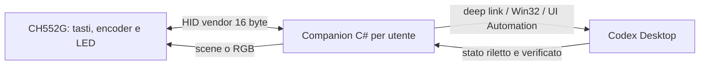

# CodexKeyboard

Controller hardware per Codex Desktop basato sulla mini keyboard USB AliExpress con microcontrollore CH552G, tre tasti, encoder rotativo con pressione e tre LED RGB indirizzabili.

Il progetto sostituisce completamente il firmware originale e usa un companion Windows quasi invisibile per tradurre gli eventi fisici in azioni verificate su Codex Desktop e per riportare lo stato sui LED.

> Ultimo aggiornamento: 16 luglio 2026 — Fase: roadmap definita, prossimo gate R0/R1

## Obiettivo

- controllare Codex Desktop con tre tasti e un knob;
- cambiare l'effort della task visibile senza modificare il default globale;
- mostrare sui tre LED RGB soltanto stati Codex verificati;
- non installare driver, non richiedere privilegi amministrativi e non mostrare finestre permanenti;
- mantenere firmware, companion e protocollo piccoli e collaudabili.

## Decisioni correnti

| Area | Decisione |
|---|---|
| Firmware | Fork minimale di [`eccherda/ch552g_mini_keyboard`](https://github.com/eccherda/ch552g_mini_keyboard), sostituendo le macro keyboard/mouse con il protocollo CodexKeyboard. |
| USB | Una collection HID vendor-specific bidirezionale. Il device non emette tasti globali e non richiede un driver custom. |
| LED | Il companion invia stato o frame RGB; effetti e animazioni sono eseguiti localmente dal firmware. |
| Companion | Applicazione C# Windows per utente, `WinExe`, senza console o finestra principale, con sola icona tray per stato, diagnostica e uscita. |
| Avvio | Autostart per utente; stesso desktop interattivo e stesso integrity level di Codex, senza elevazione. |
| Controllo Codex | Deep link ufficiali dove disponibili, API native Windows e UI Automation semantica con verifica della postcondizione. |
| App-server | Non viene avviato un secondo app-server per controllare la task posseduta da Codex Desktop. |
| Configurazione | La v1 non modifica `config.toml` e non introduce editor di mapping, database o sistema di plugin. |

## Architettura



### Dove vive lo stato

| Stato | Fonte di verità |
|---|---|
| Pressione, rilascio e scatto encoder | Firmware, dopo debounce e decodifica quadratura. |
| Effetto e frame RGB realmente visualizzati | Firmware. |
| Mapping delle sei azioni e scena LED desiderata | Companion. |
| Effort e stato della task corrente | UI di Codex riletta tramite UI Automation. |
| Default globale | `config.toml`, che CodexKeyboard non modifica. |
| Ultimo comando USB applicato | ACK del firmware con sequence number. |

Il companion non conserva una copia dell'effort considerandola autorevole: legge Codex prima dell'azione e verifica il risultato dopo l'azione. I LED cambiano stato soltanto dopo quella verifica.

## Hardware e firmware upstream

Il sorgente upstream è stato verificato al commit [`060bd13496e8ebd6a94029db8089b1544203c57a`](https://github.com/eccherda/ch552g_mini_keyboard/commit/060bd13496e8ebd6a94029db8089b1544203c57a), datato 16 novembre 2023. Il repository non pubblica release.

### Elementi confermati dal sorgente

- CH552G;
- tre pulsanti meccanici;
- encoder con rotazione CW, rotazione CCW e pressione;
- tre pixel RGB/GRB indirizzabili in cascata su `P3.4`;
- USB full-speed tramite ch55xduino;
- endpoint Interrupt IN e OUT già presenti, attualmente da 9 byte;
- firmware upstream configurato come tastiera/mouse HID;
- handler OUT presente ma vuoto: è il punto minimo da estendere per ricevere i comandi LED.

### Pinout da verificare prima del flash

| Segnale | README upstream | Sorgente upstream | Stato |
|---|---:|---:|---|
| Button 1 | `P1.6` | `P1.1` | Conflitto: misura fisica obbligatoria |
| Button 2 | `P1.7` | `P1.7` | Coerente |
| Button 3 | `P1.1` | `P1.6` | Conflitto: misura fisica obbligatoria |
| Encoder press | `P3.3` | `P3.3` | Coerente |
| Encoder A | `P3.1` | `P3.1` | Coerente |
| Encoder B | `P3.0` | `P3.0` | Coerente |
| LED data | `P3.4` | `P3.4` | Coerente |

Button 1 e Button 3 risultano invertiti tra documentazione e codice upstream. Non si effettua il primo flash prima di aver identificato la revisione PCB e verificato i pin.

### Build upstream documentata

- Arduino IDE con board package [ch55xduino](https://github.com/DeqingSun/ch55xduino);
- board CH55xDuino;
- bootloader `P3.6 (D+) Pull up`;
- clock interno 16 MHz a 3,5 V o 5 V;
- upload USB;
- impostazione `USER CODE w/148B USB RAM`.

Queste impostazioni sono un punto di partenza: il baseline deve ancora essere compilato con il toolchain Windows corrente.

### Bootloader e blast radius

Il primo flash sostituisce il firmware originale. L'upstream documenta:

1. primo ingresso nel bootloader cortocircuitando `R12` durante il collegamento USB;
2. dopo il primo flash, ingresso tenendo premuto il knob durante il collegamento;
3. in esecuzione, ingresso premendo contemporaneamente i tre tasti e il knob.

Prima del primo flash devono funzionare sia la compilazione sia una procedura di recovery provata. Il VID/PID originale `1189:8890` appartiene al firmware stock e non descriverà più il device custom.

## Firmware CodexKeyboard

La v1 elimina configurazioni, macro automatiche, emulazione mouse e tastiera generica. Restano soltanto:

- scansione dei quattro pulsanti;
- decodifica dell'encoder;
- controllo dei tre RGB;
- bootloader recovery;
- trasporto HID bidirezionale.

### Eventi fisici

Il firmware invia eventi elementari, non azioni Codex:

- press/release per Button 1, Button 2, Button 3 e knob;
- step `-1` o `+1` per ogni scatto valido dell'encoder.

Pressione lunga, doppio click e mapping applicativo restano nel companion. Questo evita di dover riflashare la tastiera per cambiare comportamento.

Il loop upstream ritarda 5 ms ma non implementa un vero debounce stabile. La v1 deve aggiungere un debounce temporale verificabile e una costante di calibrazione per gli step per detent dell'encoder.

### Protocollo HID — bozza v1

Report fissi da 16 byte, report ID incluso:

| Byte | Contenuto |
|---:|---|
| 0 | Report ID |
| 1 | Versione protocollo |
| 2 | Tipo messaggio |
| 3 | Sequence number |
| 4-15 | Payload specifico |

Messaggi device → host:

- `INPUT_EVENT`;
- `DEVICE_INFO` con versione firmware e capability;
- `ACK`/`ERROR` relativo al sequence number ricevuto.

Messaggi host → device:

- `GET_INFO`;
- `SET_SCENE` per stato semantico ed effetto locale;
- `SET_RGB` per impostare direttamente i tre pixel;
- `PING` per rilevare la presenza reale del companion.

Non serve un checksum applicativo: USB fornisce già controllo d'errore. Il sequence number serve a collegare comando e ACK, non a rendere affidabile il trasporto.

Gli input usano una piccola coda limitata; un eventuale overflow viene segnalato. I comandi LED sono last-write-wins. Valori esatti, enum e timeout diventano definitivi soltanto insieme al primo test automatico del codec del protocollo.

### Strategia LED

Il PC non invia frame di animazione continui. Invia una scena quando cambia lo stato; il CH552G anima localmente a frequenza limitata. In questo modo gli input USB non dipendono dal rendering dei LED.

| Scena | Fonte | Stato |
|---|---|---:|
| Boot / bootloader | Firmware | Supportata dall'upstream |
| Companion assente | Timeout heartbeat | Da implementare |
| Companion collegato | Handshake HID | Da implementare |
| Codex non disponibile | Ricerca finestra/processo | Da implementare |
| Effort Medium / High / Ultra | Stato UIA verificato | Tecnica già collaudata |
| Azione riuscita / fallita | Postcondizione UIA | Da implementare |
| Turno attivo / attesa approvazione / completato | Anchor semantici UIA | Da collaudare prima dell'uso |

Colori, luminosità e velocità non sono ancora fissati: vanno calibrati sul dispositivo reale. Il firmware deve sempre limitare la luminosità massima.

## Companion Windows

### Forma del processo

Il companion sarà una piccola applicazione per utente:

- output `WinExe`, nessuna console;
- nessuna finestra principale o presenza nella taskbar;
- una sola istanza;
- icona tray con stato, riconnessione, diagnostica e uscita;
- avvio automatico opzionale per l'utente corrente;
- nessun servizio Windows, driver, amministratore o `uiAccess`.

Un Windows Service non è adatto: verrebbe isolato nella Session 0, mentre il controllo di Codex deve avvenire nella sessione desktop dell'utente.

### Dipendenze

La prima versione usa soltanto .NET e API native Windows:

- WinForms per message loop e tray icon;
- SetupAPI/HID per enumerazione, hot-plug e report USB;
- `FileStream`/I/O overlapped sul device path;
- Win32 per ricerca e attivazione della finestra;
- Windows UI Automation per i controlli Codex.

Non sono previsti Avalonia, MVVM, database, web server locale o librerie HID esterne finché le API native coprono il caso.

### Controllo di Codex Desktop

Ordine delle superfici utilizzate:

1. deep link ufficiali come `codex://threads/new` e `codex://threads/<thread-id>`;
2. API Win32 per trovare, ripristinare e attivare la finestra;
3. UI Automation tramite control type, gerarchia, pattern e testo corrente;
4. verifica della postcondizione nella UI.

Non vengono usati coordinate del mouse, OCR, `AutomationId` dinamici `radix-*`, socket privati o modifica diretta dei file di stato di Codex.

Nel collaudo sul PC reale la finestra è stata trovata enumerando le top-level window del processo `ChatGPT`: classe `Chrome_WidgetWin_1`, documento accessibile `RootWebArea` con nome `Codex`. Il selettore espone un `Button` con modello ed effort correnti, quindi il controller cerca semanticamente la voce di menu che inizia con `Effort`, usa i pattern `ExpandCollapse`/`Invoke` e rilegge il pulsante come postcondizione. Il focus viene richiesto soltanto quando necessario per aprire il menu.

[`codex app-server`](https://github.com/openai/codex/blob/main/codex-rs/app-server/README.md) offre un protocollo JSON-RPC completo per i client che possiedono il server e la conversazione, ma non è documentato un attach del companion all'istanza privata già posseduta da Codex Desktop. Avviarne una seconda creerebbe un secondo proprietario dello stato e non controllerebbe in modo supportato la task visibile.

### Target e concorrenza

- La v1 supporta una finestra Codex non ambigua e agisce sulla task visibile.
- Una sola operazione UI Automation può essere attiva alla volta.
- Gli scatti rapidi del knob vengono accorpati in un breve burst e applicano un solo target finale.
- Se finestra o task cambiano durante un'operazione, l'azione fallisce senza aggiornare i LED come successo.
- Le approvazioni Codex non vengono mai accettate automaticamente.

## Mapping proposto per la v1

| Controllo | Azione |
|---|---|
| Button 1 | Attiva/ripristina Codex |
| Button 2 | Nuova task tramite `codex://threads/new` |
| Button 3 | Stop del turno corrente, protetto da doppia pressione o pressione lunga |
| Knob CCW | Effort precedente: `Medium → High → Ultra` |
| Knob CW | Effort successivo: `Medium → High → Ultra` |
| Knob press | Attiva Codex e mostra/conferma l'effort corrente |

La tecnica UI Automation ha già cambiato realmente l'effort della task visibile fra `Ultra` ed `Extra High`, verificando il valore finale e senza modificare `model_reasoning_effort` in `config.toml`.

## Stato del progetto

| Area | Stato | Prossimo gate |
|---|---:|---|
| Analisi dispositivo stock `1189:8890` | Completata | Informazioni ancora utili assorbite in questo README |
| Controllo effort tramite UI Automation | Collaudato sul PC reale | Ripetere dopo implementazione companion |
| Scelta firmware custom | Decisa | Importare il minimo upstream |
| Revisione sorgente upstream | Completata | Risolvere pinout Button 1/3 |
| Architettura USB vendor HID | Definita | Congelare byte layout con test codec |
| Architettura companion nascosto | Definita | Creare il minimo progetto `WinExe` |
| Build firmware baseline | Non iniziata | Installare/pinnare toolchain e compilare |
| Flash sul dispositivo | Non iniziato | Verificare recovery e pinout |
| Protocollo HID firmware/host | Non iniziato | Loopback e hot-plug |
| Scene RGB | Non iniziate | Calibrazione luminosità e timing |
| Rilevamento stati Codex | Parziale | Catturare anchor UIA per ogni stato |
| Collaudo end-to-end | Non iniziato | Un evento fisico = una sola azione verificata |

## Roadmap

La roadmap è governata da gate verificabili, non da date. Una fase è conclusa soltanto quando il suo criterio di uscita è soddisfatto.

```text
R0 Hardware ─┐
             ├─> R2 Flash baseline -> R3 Protocollo -> R4 Firmware -> R5 Companion HID
R1 Build  ───┘                                                     -> R6 Codex -> R7 LED -> R8 Release
```

| ID | Fase | Responsabile | Stato |
|---|---|---|---:|
| R0 | Verità hardware e recovery | Insieme | Prossima |
| R1 | Baseline firmware riproducibile | Codex | Prossima |
| R2 | Primo flash e collaudo upstream | Insieme | In attesa di R0/R1 |
| R3 | Contratto HID v1 | Codex | In attesa di R2 |
| R4 | Firmware CodexKeyboard | Codex + collaudo utente | In attesa di R3 |
| R5 | Companion HID nascosto | Codex | In attesa di R4 |
| R6 | Controllo Codex end-to-end | Codex + collaudo utente | In attesa di R5 |
| R7 | Feedback LED verificato | Insieme | In attesa di R6 |
| R8 | Packaging e accettazione v1 | Insieme | In attesa di R7 |

### R0 — Verità hardware e recovery

**Operazioni**

- fotografare ad alta risoluzione entrambi i lati della PCB e il marking del microcontrollore;
- identificare revisione PCB, `R12`, piazzole e percorso del segnale dei tasti;
- verificare con continuità se Button 1/Button 3 sono su `P1.1` o `P1.6`;
- confermare encoder press `P3.3`, encoder A/B `P3.1/P3.0` e LED data `P3.4`;
- verificare che il metodo fisico per entrare nel bootloader sia accessibile e ripetibile.

**Deliverable:** pinout definitivo nel README e checklist di recovery.

**Gate di uscita:** nessun pin ambiguo e procedura di bootloader fisicamente praticabile.

**Stop condition:** nessun flash finché questo gate non è chiuso.

### R1 — Baseline firmware riproducibile

**Operazioni**

- importare il commit upstream già fissato in una directory `firmware/`, conservando licenza e attribuzione;
- fissare versione e configurazione del toolchain ch55xduino;
- compilare il firmware upstream invariato da riga di comando su Windows;
- registrare comando di build, dimensione flash/RAM e artefatto prodotto;
- aggiungere il controllo minimo che ricompila il baseline da un checkout pulito.

**Deliverable:** sorgente upstream tracciato e build documentata.

**Gate di uscita:** compilazione ripetibile senza modifiche manuali nell'IDE.

**Nota:** R0 e R1 possono procedere in parallelo; entrambi bloccano R2.

### R2 — Primo flash e collaudo upstream

**Operazioni**

- entrare nel bootloader tramite `R12` e salvare gli identificativi osservati;
- flashare il baseline upstream compilato in R1;
- verificare enumerazione USB, tre tasti, pressione knob, entrambi i versi dell'encoder e tre RGB;
- scollegare e riconnettere il device;
- rientrare nel bootloader sia con knob premuto al collegamento sia con il chord dei quattro tasti.

**Deliverable:** verbale di banco con esito di ogni input, LED e metodo di recovery.

**Gate di uscita:** baseline funzionante e recovery provata dopo il primo flash.

**Stop condition:** se la recovery fallisce, non si modifica ancora lo stack USB.

### R3 — Contratto HID v1

**Operazioni**

- congelare report ID, enum, payload, sequence number, capability e comportamento al wrap;
- definire timeout heartbeat, ACK/ERROR e gestione della versione incompatibile;
- produrre un vettore binario atteso per ogni messaggio valido e per gli errori essenziali;
- implementare il codec host puro e un solo test automatico sui vettori;
- decidere VID/PID e stringhe USB usati da CodexKeyboard prima del nuovo descriptor.

**Deliverable:** protocollo v1 e vettori binari che costituiscono il test oracle.

**Gate di uscita:** ogni report da 16 byte ha un significato univoco e un esempio verificabile.

**Stop condition:** firmware e companion non inventano enum separati fuori dal contratto.

### R4 — Firmware CodexKeyboard

**Operazioni**

- rimuovere macro, menu di configurazione, keyboard HID e mouse HID;
- esporre soltanto la collection HID vendor-specific IN/OUT;
- implementare debounce temporale, calibrazione encoder e coda input limitata;
- implementare `GET_INFO`, eventi input, ACK/ERROR, heartbeat, `SET_SCENE` e `SET_RGB`;
- rendere gli effetti LED non bloccanti e applicare un limite di luminosità;
- conservare entrambe le vie di ingresso nel bootloader.

**Deliverable:** firmware CodexKeyboard flashabile.

**Gate di uscita:** Windows non lo vede come tastiera, le sei azioni arrivano una sola volta, RGB e ACK funzionano e il timeout torna alla scena companion-assente.

**Verifica hardware:** rotazioni lente/rapide, pressioni simultanee, reconnect e recovery.

### R5 — Companion HID nascosto

**Operazioni**

- creare il minimo progetto C# `WinExe` con message loop, tray icon e single-instance;
- enumerare soltanto la collection CodexKeyboard tramite SetupAPI/HID;
- implementare I/O asincrono, handshake, heartbeat, ACK/timeout e hot-plug;
- serializzare le scritture e riconnettere senza riavviare il processo;
- mantenere diagnostica limitata e accessibile dal menu tray;
- collaudare input e LED senza ancora comandare Codex.

**Deliverable:** companion che controlla completamente il device ma non Codex.

**Gate di uscita:** funziona avviando prima il device o prima il companion e recupera da unplug/replug senza input duplicati.

### R6 — Controllo Codex end-to-end

Le azioni entrano una alla volta, in questo ordine:

1. trovare, ripristinare e attivare una finestra Codex non ambigua;
2. aprire una nuova task con il deep link ufficiale;
3. leggere l'effort corrente;
4. cambiare effort con burst del knob e verificare la postcondizione;
5. mostrare/confermare l'effort con knob press;
6. interrompere un turno con Button 3 protetto e postcondizione verificata.

Ogni operazione passa attraverso una sola coda UI Automation. Cambio finestra/task, selector ambiguo o postcondizione fallita producono errore senza azioni successive.

**Deliverable:** mapping v1 completo.

**Gate di uscita:** ogni evento fisico produce una sola azione Codex verificata in foreground, background e finestra minimizzata.

**Stop condition:** nessuna automazione di approvazioni e nessun fallback a coordinate o IPC privati.

### R7 — Feedback LED verificato

**Operazioni**

- mappare prima connessione companion, disponibilità Codex, effort e successo/errore dell'ultima azione;
- calibrare sul dispositivo colori, luminosità, frequenza e durata degli effetti;
- aggiornare la scena soltanto dopo la verifica dello stato sorgente;
- provare crash/restart del companion e chiusura/riapertura di Codex;
- aggiungere turno attivo, attesa approvazione o completamento soltanto se emerge un anchor UIA stabile con postcondizione.

**Deliverable:** tabella definitiva stato → scena e implementazione corrispondente.

**Gate di uscita:** nessun LED comunica uno stato non confermato; heartbeat e errori tornano sempre a una scena sicura.

**Deferred:** gli stati semantici fragili non bloccano la v1.

### R8 — Packaging e accettazione v1

**Operazioni**

- pubblicare il companion per utente senza privilegi amministrativi;
- aggiungere autostart opzionale, uscita tray e procedura di rimozione;
- verificare che non vengano installati driver o servizi;
- eseguire la matrice con Codex avviato/chiuso, foreground/background/minimizzato, cambio task, turno attivo, USB unplug/replug e rotazioni rapide;
- ripetere il collaudo UI Automation sulla versione Codex installata;
- aggiornare stato, limiti noti e istruzioni operative nel README.

**Deliverable:** release v1 installabile e rimovibile per utente.

**Gate di uscita:** soddisfatti tutti i criteri di completamento v1 riportati sotto.

### Prossima operazione

Avviare R0 e R1 in parallelo:

- **Utente:** fornire foto nitide dei due lati della PCB e la verifica di continuità di Button 1/Button 3;
- **Codex:** importare il commit upstream fissato e rendere riproducibile il build baseline, senza ancora flashare il device.

## Sicurezza e limiti

- nessuna credenziale OpenAI viene letta o memorizzata;
- nessun input delle altre tastiere viene intercettato;
- il companion apre soltanto la collection HID CodexKeyboard attesa;
- nessuna approvazione, prompt o comando distruttivo viene automatizzato nella v1;
- gli errori sono fail-closed: niente azione successiva e niente LED di falso successo;
- un aggiornamento di Codex può cambiare il tree UIA e richiede un nuovo collaudo;
- un device USB può falsificare VID/PID/seriale: l'identità HID riduce gli errori, non costituisce autenticazione forte.

## Identità USB e licenze

L'upstream usa `VID 1209 / PID C55D`. Quel valore non viene assunto automaticamente come identità definitiva di CodexKeyboard: prima di distribuire il firmware va assegnato o verificato un PID appropriato e stabile.

Il repository upstream dichiara la licenza [Creative Commons Attribution-ShareAlike 3.0 Unported](https://github.com/eccherda/ch552g_mini_keyboard/blob/master/LICENCE). Finché non viene fatta una verifica specifica, il firmware derivato deve conservare attribuzione, avvisi e condizioni share-alike. Il companion scritto da zero resta separato dal codice derivato.

## Documentazione e fonti

- [Firmware upstream CH552G](https://github.com/eccherda/ch552g_mini_keyboard)
- [ch55xduino](https://github.com/DeqingSun/ch55xduino)
- [Codex app-server](https://github.com/openai/codex/blob/main/codex-rs/app-server/README.md)
- [Comandi e deep link di Codex](https://learn.chatgpt.com/docs/developer-commands)
- [Windows HID](https://learn.microsoft.com/windows-hardware/drivers/hid/)
- [Windows UI Automation](https://learn.microsoft.com/windows/win32/winauto/entry-uiautocore-overview)

## Criterio di completamento v1

La v1 è completa quando ogni controllo fisico produce una sola azione prevista, la postcondizione è verificata in Codex, i LED mostrano soltanto stato confermato e scollegamento/ripristino del device o di Codex non richiedono il riavvio del PC.
