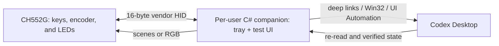

# CodexKeyboard

Hardware controller for Codex Desktop based on the AliExpress USB mini keyboard with a CH552G microcontroller, three keys, a pressable rotary encoder, and three addressable RGB LEDs.

The project completely replaces the stock firmware and uses an almost invisible Windows companion to translate physical events into verified Codex Desktop actions and report state through the LEDs.

> Last updated: July 22, 2026 — Phase: R5 completed; R6 end-to-end Codex control is next

## Goal

- control Codex Desktop with three keys and a knob;
- change the effort of the visible task without modifying the global default;
- show only verified Codex states on the three RGB LEDs;
- install no drivers, require no administrator privileges, and show no permanent windows;
- keep the firmware, companion, and protocol small and testable.

## Current decisions

| Area | Decision |
|---|---|
| Firmware | Minimal fork of [`eccherda/ch552g_mini_keyboard`](https://github.com/eccherda/ch552g_mini_keyboard), replacing keyboard/mouse macros with the CodexKeyboard protocol. |
| USB | One bidirectional vendor-defined HID collection. The device emits no global keystrokes and requires no custom driver. |
| LEDs | The companion sends a state or RGB frame; effects and animations run locally in the firmware. |
| Companion | One per-user C# `WinExe`: tray-only in normal use, with an on-demand WinForms hardware-test window. The same process and HID session serve both modes. |
| Startup | Per-user autostart; same interactive desktop and integrity level as Codex, without elevation. |
| Codex control | Official deep links where available, native Windows APIs, and semantic UI Automation with postcondition verification. |
| App server | No second app server is started to control the task owned by Codex Desktop. |
| Configuration | v1 does not modify `config.toml` and introduces no mapping editor, database, or plugin system. |

## Architecture



### Where state lives

| State | Source of truth |
|---|---|
| Press, release, and encoder detent | Firmware, after debouncing and quadrature decoding. |
| Effect and RGB frame actually displayed | Firmware. |
| Mapping of the six actions and desired LED scene | Companion. |
| Current task effort and state | Codex UI re-read through UI Automation. |
| Global default | `config.toml`, which CodexKeyboard does not modify. |
| Last applied USB command | Firmware ACK with sequence number. |

The companion does not keep a copy of the effort and treat it as authoritative: it reads Codex before the action and verifies the result afterward. The LEDs change state only after that verification.

## Hardware and upstream firmware

The upstream source was inspected at commit [`060bd13496e8ebd6a94029db8089b1544203c57a`](https://github.com/eccherda/ch552g_mini_keyboard/commit/060bd13496e8ebd6a94029db8089b1544203c57a), dated November 16, 2023. The repository publishes no releases.

The user confirmed that the physical keyboard is visually identical to the keyboard and PCB shown in the upstream photographs. Subsequent physical checks confirmed the ambiguous button pins and access to the `R12` bootloader pads.

### Elements confirmed by the source code

- CH552G;
- three mechanical push buttons;
- encoder with clockwise rotation, counterclockwise rotation, and press;
- three addressable RGB/GRB pixels chained on `P3.4`;
- full-speed USB through ch55xduino;
- Interrupt IN and OUT endpoints already present, currently 9 bytes;
- upstream firmware configured as a keyboard/mouse HID device;
- OUT handler present but empty: this is the smallest extension point for receiving LED commands.

### Verified pinout

| Signal | Upstream README | Upstream source | Status |
|---|---:|---:|---|
| Button 1 | `P1.6` | `P1.1` | Verified by physical continuity: `P1.1` |
| Button 2 | `P1.7` | `P1.7` | Consistent |
| Button 3 | `P1.1` | `P1.6` | Verified by physical continuity: `P1.6` |
| Encoder press | `P3.3` | `P3.3` | Consistent |
| Encoder A | `P3.1` | `P3.1` | Consistent |
| Encoder B | `P3.0` | `P3.0` | Consistent |
| LED data | `P3.4` | `P3.4` | Consistent |

Button 1 and Button 3 are swapped between the upstream documentation and source code. The user's physical continuity measurements confirm that the source code matches the device: Button 1 is on `P1.1` and Button 3 is on `P1.6`.

### Reproducible baseline build

The maintained baseline is in [`firmware/CodexKeyboard`](firmware/CodexKeyboard), derived from the pinned upstream commit with its license and attribution preserved. The sketch was renamed, non-English comments were translated, and trailing whitespace was removed; the compiled firmware is unchanged.

Pinned toolchain:

- Arduino CLI `0.35.2`; Windows x64 archive SHA-256 `831e71e91cda08071599a570fb40937c9cf0f0e8cf7711a7e24c7ee28b5406a7`;
- ch55xduino `0.0.20`; core archive SHA-256 `bcc0961c6261ab55d74fb04bdb873dd7cee853d46b6113c887068fd90b3d5efe`;
- transitive tools `MCS51Tools 2023.10.10` and SDCC `build.13407_4`;
- FQBN `CH55xDuino:mcs51:ch552:usb_settings=user148,upload_method=usb,clock=16internal,bootloader_pin=p36`.

After the first successful flash, temporary Zadig, `wchisp`, `ch55xtool`, Python-environment, and helper files were removed from ignored `.tools`. The directory retains only the pinned Arduino CLI, its configuration, the installed CH55xDuino data/toolchain, and the download cache required for repeatable offline builds and uploads. A direct post-cleanup compilation completed with the same flash/RAM measurements and reproduced the expected HEX SHA-256.

Run from the repository root:

```powershell
pwsh -File .\Build-Firmware.ps1
```

The script verifies the Arduino CLI download, installs the pinned core into ignored repository-local directories, performs a clean command-line build, and produces `.build/firmware/CodexKeyboard.ino.hex` without using the Arduino IDE.

R1 result on July 17, 2026:

| Measurement | Result |
|---|---:|
| Flash | 12,751 / 14,336 bytes (88%) |
| Global RAM | 612 / 876 bytes (69%); 264 bytes remain |
| HEX size | 36,149 bytes |
| HEX SHA-256 | `4e7b2a73f17d8e882c9a109b40582de121a3a6c06a55bc873999bb92573acdb8` |

The renamed maintained baseline and the pinned upstream snapshot produce byte-for-byte identical HEX files. The core emits repeated `Multiple definition of _dummy_variable` diagnostics but exits successfully; no warning was hidden or patched locally.

### Bootloader and blast radius

The first flash replaces the stock firmware. The upstream project documents:

1. first bootloader entry by shorting `R12` while connecting the device to USB;
2. after the first flash, entry by holding the knob while connecting the device;
3. during operation, entry by pressing all three keys and the knob at the same time.

Both facilitated post-flash paths are preserved in the maintained R4 source. `setup()` checks the active-low encoder button before USB initialization and calls `BOOT_now()`; the debounced running input scanner calls the same routine when all three keys and the encoder button are active. `BOOT_now()` disables USB, interrupts, and timers before jumping to the internal bootloader. R2 physically verified both paths on the baseline image, and both are now reconfirmed on the R4 `1.1.0` image.

The bootloader `2.50` session entered through the running four-control chord remains available for only a few seconds when no uploader communicates with it, then resets automatically into the firmware. This observed behavior is consistent with an independent disassembly that identifies a Timer 0 timeout and automatic soft reset in bootloader `2.50`; no matching WCH specification has been located, so this is supporting reverse-engineering evidence rather than a vendor guarantee. In practice, start the uploader before entering through the chord or begin the upload immediately afterward.

#### Remote bootloader control assessment

The July 22, 2026 assessment separates application firmware from the immutable WCH ROM bootloader:

- Runtime-to-bootloader control is present in the flashed `1.1.0` image. The guarded vendor-HID command reuses `BOOT_now()`: firmware validates the complete arming payload, sends its ACK, waits for an explicit completion flag set only by the interrupt-IN handler, renders the transition indicator, and only then disables USB and jumps. A USB transport reset clears rather than sets that completion flag, and the physical chord cannot preempt an already armed remote transition. The R3 contract, executable vector, and firmware parity check cover this ordering.
- Bootloader-to-runtime control cannot use CodexKeyboard HID because `1209:C55D` disappears after the jump. The open-source [`wchisp` implementation](https://github.com/ch32-rs/wchisp/blob/main/src/flashing.rs) ends the ISP session with `IspEnd(1)` and validates its response; its [wire encoder](https://github.com/ch32-rs/wchisp/blob/main/src/protocol.rs) emits the four-byte ISP-end request. [`ch55xtool`](https://github.com/MarsTechHAN/ch552tool/blob/master/ch55xtool/ch55xtool.py) independently exposes the same restart behavior through `--reset_at_end`. The development-only helper now uses the official WCH driver API to send that command and is not a dependency of the final driverless companion. The observed idle timeout and a USB power cycle remain independent exit paths.
- A continuously pulsing physical LED while the CPU executes the ROM bootloader is not possible on this board. The three WS2812-compatible pixels have no animation engine: application firmware must transmit every new frame over `P3.4`, while `BOOT_now()` disables application execution before jumping to ROM. The closest truthful indication is a blue breathe animation during a short pre-jump transition, followed by an all-blue frame latched immediately before the jump. The latched solid-blue behavior while ROM owns the CPU must be physically verified because it depends on the pixels retaining their last frame and the ROM not disturbing `P3.4`.

The approved minimal behavior is therefore: acknowledge a guarded `ENTER_BOOTLOADER` command, breathe blue for 1.2 seconds, latch solid blue, enter ROM, and let a separate development helper issue the WCH reset command when an immediate return is needed. Replacing the ROM bootloader or adding a second LED controller solely to preserve animation is outside the project scope.

Both remote directions have now been exercised on the physical keyboard. The development tool verified the exact `1.1.0` runtime handshake, received the guarded command ACK, observed the exact CH552 ROM `2.50` descriptor, sent `ISP_END`, and verified that the same runtime identity and handshake returned. The ROM disappeared before its reply could be read, so the returning runtime handshake is the recorded exit postcondition. The user physically confirmed the all-LED blue breathe transition followed by solid blue while ROM owned the CPU.

The x64 development tool is dependency-free except for the official WCH DLL used only by `exit`. It requires the exact USB parent instance `USB\VID_1209&PID_C55D\CK498AED4EBD`, HID VID/PID/release, usage, report sizes, `DEVICE_INFO`, and remote-bootloader capability before `enter`. This parent-devnode check is necessary because Windows returns `ERROR_GEN_FAILURE` when the HID string helper queries this firmware after enumeration; it preserves exact serial binding without weakening identity checks. `exit` is authorized only by a recent transition initiated from that serial, reconciles the independent PnP count with exactly one WCH-opened `4348:55E0` device and its CH552 ROM `2.50` descriptor, takes exclusive access, and then sends `A2 01 00 01`. The transition authorization remains available through non-mutating preconditions and is consumed immediately before the first write attempt, after which retry would be unsafe. The exact returning runtime identity and handshake are the postcondition even when ROM resets before returning its reply. Run:

```powershell
dotnet run --project .\tools\CodexKeyboard.BootloaderTool\CodexKeyboard.BootloaderTool.csproj -- enter
dotnet run --project .\tools\CodexKeyboard.BootloaderTool\CodexKeyboard.BootloaderTool.csproj -- exit
dotnet run --project .\tools\CodexKeyboard.BootloaderTool\CodexKeyboard.BootloaderTool.csproj -- status
dotnet run --project .\tools\CodexKeyboard.BootloaderTool\CodexKeyboard.BootloaderTool.csproj -- self-test
```

Before the first flash, both the build and a proven recovery procedure must work. The original `1189:8890` VID/PID belongs to the stock firmware and will no longer describe the custom device.

## CodexKeyboard firmware

v1 removes configurations, automatic macros, mouse emulation, and generic keyboard emulation. Only these parts remain:

- scanning the four push buttons;
- decoding the encoder;
- controlling the three RGB LEDs;
- bootloader recovery;
- bidirectional HID transport.

### Physical events

The firmware sends primitive events, not Codex actions:

- press/release for Button 1, Button 2, Button 3, and the knob;
- `-1` or `+1` step for each valid encoder detent.

Long press, double-click, and application mapping stay in the companion. This avoids reflashing the keyboard when behavior changes.

R4 replaces the upstream 5 ms polling delay with a non-blocking loop. A button state must remain stable for 8 ms before it produces an event. The quadrature decoder requires three valid transitions before returning to its idle state; this named calibration point preserves the behavior observed with the baseline encoder and must be confirmed with slow and fast physical rotations. Events enter an eight-item FIFO. Sequence numbers are assigned before insertion so overflow remains detectable.

### HID protocol — v1

R3 freezes this contract. All multi-byte values are little-endian, every unused or reserved byte must be zero, and logical LED components are ordered RGB even though the firmware translates them to the physical GRB chain. USB already provides transport error detection, so the protocol adds no checksum.

#### USB transport and identity

| Field | v1 value |
|---|---|
| VID / PID | `1209:C55D` — the pid.codes allocation for ch55xduino HID devices |
| Device release | `0x0110` |
| Interface | HID class, no boot subclass, no boot protocol |
| Collection | Vendor-defined usage page `0xFF00`, usage `0x01` |
| IN / OUT endpoints | Interrupt `0x81` / `0x01`, 16 bytes, 10 ms polling interval |
| Report ID | `0x01` for both Input and Output reports |
| Manufacturer / product | `CodexKeyboard` / `CodexKeyboard` |
| Serial | `CK` followed by the five-byte CH552 unique ID as ten uppercase hexadecimal digits |

The serial bytes are encoded in this fixed order: the low byte at `ROM_CHIP_ID_HX`, the low and high bytes of `ROM_CHIP_ID_LO`, then the low and high bytes of `ROM_CHIP_ID_HI`. The pinned CH552 headers map those values to code addresses `0x3FFA`, `0x3FFC`–`0x3FFD`, and `0x3FFE`–`0x3FFF`.

`1209:C55D` is intentionally retained for the private v1 because it is the registered ch55xduino HID family allocation already used by the baseline. It is not unique to CodexKeyboard. The companion must require the complete identity above, exactly one matching collection, and a valid `DEVICE_INFO` handshake; zero or multiple candidates fail closed. A project-specific PID should be requested before public distribution to avoid collisions with other ch55xduino HID devices.

#### Common report header

Every report is exactly 16 bytes, including its report ID:

| Byte | Content |
|---:|---|
| 0 | Report ID `0x01` |
| 1 | Protocol version `0x01` |
| 2 | Message type |
| 3 | Sequence number |
| 4–15 | Message-specific payload |

Message types use separate ranges for each direction:

| Value | Direction | Message | Successful response |
|---:|---|---|---|
| `0x01` | Host → device | `GET_INFO` | `DEVICE_INFO` |
| `0x02` | Host → device | `SET_SCENE` | `ACK` |
| `0x03` | Host → device | `SET_RGB` | `ACK` |
| `0x04` | Host → device | `PING` | `ACK` |
| `0x05` | Host → device | `ENTER_BOOTLOADER` | `ACK`, then USB disconnect |
| `0x81` | Device → host | `INPUT_EVENT` | Unsolicited |
| `0x82` | Device → host | `DEVICE_INFO` | Terminal response to `GET_INFO` |
| `0x83` | Device → host | `ACK` | Terminal response |
| `0x84` | Device → host | `ERROR` | Terminal response |

#### Host-to-device payloads

`GET_INFO` and `PING` require bytes 4–15 to be zero. `ENTER_BOOTLOADER` requires bytes 4–15 to contain the exact ASCII arming token `CKBOOTLOADER`; any mismatch returns `INVALID_PAYLOAD` at the first mismatching byte.

`SET_SCENE`:

| Byte | Content |
|---:|---|
| 4 | Scene |
| 5 | Effect |
| 6 | Brightness, from zero through the maximum advertised by `DEVICE_INFO` |
| 7–8 | Effect period in 10 ms units |
| 9–15 | Zero |

Scenes:

| Value | Scene |
|---:|---|
| `0x00` | `COMPANION_ABSENT` |
| `0x01` | `COMPANION_CONNECTED` |
| `0x02` | `CODEX_UNAVAILABLE` |
| `0x03` | `EFFORT_MEDIUM` |
| `0x04` | `EFFORT_HIGH` |
| `0x05` | `EFFORT_ULTRA` |
| `0x06` | `ACTION_SUCCEEDED` |
| `0x07` | `ACTION_FAILED` |
| `0x08` | `TURN_ACTIVE` |
| `0x09` | `WAITING_FOR_APPROVAL` |
| `0x0A` | `COMPLETED` |

Effects are `SOLID = 0x00`, `BLINK = 0x01`, and `BREATHE = 0x02`. `SOLID` requires a zero period; animated effects require a period from 1 through 6,000 units. A scene remains active until the next LED command or heartbeat expiry. Firmware owns rendering and always enforces its advertised brightness ceiling.

`SET_RGB` places `R`, `G`, and `B` for LED 1 in bytes 4–6, LED 2 in bytes 7–9, and LED 3 in bytes 10–12. Bytes 13–15 are zero. Every component must be at or below the advertised maximum brightness. The frame is last-write-wins and remains active until the next LED command or heartbeat expiry.

#### Device-to-host payloads

Controls are `BUTTON_1 = 0x01`, `BUTTON_2 = 0x02`, `BUTTON_3 = 0x03`, `KNOB_BUTTON = 0x04`, and `ENCODER = 0x05`. Input kinds are `PRESS = 0x01`, `RELEASE = 0x02`, and `ROTATE = 0x03`.

`INPUT_EVENT`:

| Byte | Content |
|---:|---|
| 4 | Control |
| 5 | Input kind |
| 6 | Signed value: zero for press/release, `-1` for counterclockwise, `+1` for clockwise |
| 7 | Flags; bit 0 means `QUEUE_OVERFLOW`, all other bits are zero |
| 8 | Button state: normally post-event; current physical state when `QUEUE_OVERFLOW` is set. Bits 0–3 are Button 1, Button 2, Button 3, and knob press |
| 9–15 | Zero |

The firmware assigns the event sequence before queue insertion. A dropped event therefore creates a detectable sequence gap, and the next delivered event also carries the sticky `QUEUE_OVERFLOW` flag and the current physical button state. The host codec requires event/state agreement during normal delivery but permits this explicit resynchronization exception when the overflow flag is set. On either indication the companion discards pending gestures, does not create a Codex action from the uncertain event, adopts the supplied button state, and resumes only after all buttons are released.

`DEVICE_INFO`:

| Byte | Content |
|---:|---|
| 4–6 | Firmware major, minor, patch |
| 7–8 | Capability bitmap |
| 9 | Button count, `4` including knob press |
| 10 | Encoder count, `1` |
| 11 | RGB LED count, `3` |
| 12 | Maximum allowed value for each RGB component |
| 13–15 | Zero |

Capability bits are: bit 0 buttons, bit 1 encoder, bit 2 scenes, bit 3 direct RGB, bit 4 heartbeat watchdog, bit 5 queue-overflow reporting, and bit 6 guarded remote bootloader entry. All seven capabilities are required by the amended CodexKeyboard v1 contract.

`ACK` stores the acknowledged host message type in byte 4 and zeroes bytes 5–15.

`ERROR` stores the failed message type in byte 4, the error code in byte 5, a detail byte in byte 6, and zeroes bytes 7–15. Error codes are `UNSUPPORTED_VERSION = 0x01`, `UNKNOWN_MESSAGE_TYPE = 0x02`, `WRONG_DIRECTION = 0x03`, `INVALID_PAYLOAD = 0x04`, and `UNSUPPORTED_VALUE = 0x05`. Detail is the supported version for `UNSUPPORTED_VERSION`, otherwise the failing report-byte offset, or `0xFF` when no exact byte applies.

#### Ordering, timing, and failure behavior

- The host starts at sequence zero after opening a device and increments after every command, wrapping from `0xFF` to `0x00`. Only one command may be outstanding.
- `DEVICE_INFO`, `ACK`, and `ERROR` echo the host command sequence. The device does not implement replay storage or ordering policy; repeated idempotent commands are processed again.
- `INPUT_EVENT` uses an independent counter that starts at zero after device reset and wraps modulo 256. The first event after a handshake establishes the host baseline; later gaps are handled as input loss.
- A command has a 250 ms response deadline. The companion does not retry after an ambiguous timeout: it closes the handle, clears input state, reports the failure, and reconnects.
- `ENTER_BOOTLOADER` is never retried. Firmware waits for the ACK's actual interrupt-IN completion, breathes blue for 1.2 seconds, latches solid blue, and then jumps to ROM. USB deconfiguration before ACK completion cancels the request.
- The companion sends `PING` after one second without another valid command. Any valid host command refreshes the device watchdog. Three seconds without one activates `COMPANION_ABSENT`; invalid reports do not refresh it.
- A structurally valid report with an unsupported version, type, direction, payload, or value receives one `ERROR`. A wrong report ID or length is dropped because its sequence cannot be trusted.
- LED commands are last-write-wins. Input events use a bounded FIFO; USB input transmission remains independent from LED animation.

#### Binary vectors and executable oracle

These vectors cover every message and every protocol error code. Values such as firmware version and brightness are valid examples, not device calibration measurements.

| Vector | 16 bytes |
|---|---|
| `GET_INFO` | `01 01 01 10 00 00 00 00 00 00 00 00 00 00 00 00` |
| `SET_SCENE` | `01 01 02 11 04 02 20 64 00 00 00 00 00 00 00 00` |
| `SET_RGB` | `01 01 03 12 20 00 00 00 20 00 00 00 20 00 00 00` |
| `PING` | `01 01 04 FF 00 00 00 00 00 00 00 00 00 00 00 00` |
| `ENTER_BOOTLOADER` | `01 01 05 13 43 4B 42 4F 4F 54 4C 4F 41 44 45 52` |
| `INPUT_EVENT` | `01 01 81 7F 05 03 FF 00 05 00 00 00 00 00 00 00` |
| `DEVICE_INFO` | `01 01 82 10 01 01 00 7F 00 04 01 03 FF 00 00 00` |
| `ACK` | `01 01 83 13 05 00 00 00 00 00 00 00 00 00 00 00` |
| `ERROR/UNSUPPORTED_VERSION` | `01 01 84 20 01 01 01 00 00 00 00 00 00 00 00 00` |
| `ERROR/UNKNOWN_MESSAGE_TYPE` | `01 01 84 21 7F 02 02 00 00 00 00 00 00 00 00 00` |
| `ERROR/WRONG_DIRECTION` | `01 01 84 22 81 03 02 00 00 00 00 00 00 00 00 00` |
| `ERROR/INVALID_PAYLOAD` | `01 01 84 23 01 04 04 00 00 00 00 00 00 00 00 00` |
| `ERROR/UNSUPPORTED_VALUE` | `01 01 84 24 03 05 04 00 00 00 00 00 00 00 00 00` |

The dependency-free host codec and its vector check live in `src/CodexKeyboard.Protocol` and `tests/CodexKeyboard.Protocol.Check`. Run:

```powershell
dotnet run --project .\tests\CodexKeyboard.Protocol.Check\CodexKeyboard.Protocol.Check.csproj
```

### LED strategy

The PC does not continuously stream animation frames. It sends a scene when state changes, and the CH552G animates it locally at a limited rate. This keeps USB input independent from LED rendering.

| Scene | Source | Status |
|---|---|---:|
| Boot / bootloader | Firmware | Guarded transition and blue breathe-to-solid indication physically verified |
| Companion absent | Heartbeat timeout | Implemented and physically verified through the integrated R5 test |
| Companion connected | HID handshake | Implemented and physically verified through the integrated R5 companion |
| Codex unavailable | Window/process lookup | To implement |
| Medium / High / Ultra effort | Verified UIA state | Technique already tested |
| Action succeeded / failed | UIA postcondition | To implement |
| Turn active / waiting for approval / completed | Semantic UIA anchors | Must be tested before use |

Colors, default brightness, and speed are not fixed yet and must be calibrated on the real device. RGB components use their full native 8-bit range (`0`–`255`); firmware introduces no lower artificial ceiling.

## Windows companion

### Process shape

The companion is a small per-user application:

- `WinExe` output with no console;
- no permanent main window or taskbar presence;
- a single instance;
- tray icon with status, reconnect, hardware tests, and exit;
- an on-demand WinForms hardware-test window; visible means hardware-test mode, while closing or minimizing it restores normal companion mode and hides it in the tray;
- optional autostart for the current user is planned for R8;
- no Windows Service, driver, administrator privileges, or `uiAccess`.

A Windows Service is unsuitable because it would be isolated in Session 0, while controlling Codex must happen in the user's desktop session.

### Dependencies

The first version uses only .NET and native Windows APIs:

- WinForms for the message loop and tray icon;
- SetupAPI/HID for enumeration, hot-plug, and USB reports;
- `FileStream`/overlapped I/O on the device path;
- Win32 for finding and activating the window;
- Windows UI Automation for Codex controls.

Avalonia, MVVM, a database, a local web server, and external HID libraries are not planned while native APIs cover the use case.

### Integrated hardware tests

The hardware tester is not a second executable and never opens a competing device handle. `CodexKeyboard.Companion` owns one exact HID session in both modes, while its compact single-screen test window is only a view and command surface over that owner. A local-session named ownership semaphore also prevents the development bootloader tool or another companion process from consuming reports concurrently.

The window exposes:

- compact live press/release indicators for Button 1, Button 2, Button 3, and knob press;
- visual clockwise or counterclockwise encoder feedback without persistent tick counters;
- sequence-gap, queue-overflow, stale-queue draining, and release-resynchronization feedback;
- `GET_INFO`, `PING`, all protocol scenes and effects, the full `0`–`255` brightness range, and three native Windows color selectors for independent LED RGB values;
- a watchdog test that serializes all host operations, remains silent for 3.75 seconds, then uses `GET_INFO` to recover the session; the operator still confirms the intervening companion-absent LED scene visually;
- guarded `ENTER_BOOTLOADER` behind an explicit warning and confirmation. Entry from this UI creates no development-tool authorization marker, so recovery is limited to the ROM timeout or a USB power cycle. Explicit `ISP_END` remains available only for a transition initiated by `CodexKeyboard.BootloaderTool enter`, because it depends on the WCH interface and a short-lived authorization; the final companion remains driverless.

Inputs, device output, and diagnostics share one screen without tabs or raw-event tables. Safety and bootloader warnings live in the Diagnostics section. Diagnostics are bounded to 500 entries and remain available while the test window is hidden. Successful heartbeat traffic is intentionally not logged. Closing the window requests the firmware's companion-connected scene and hides the UI; double-clicking the tray icon or choosing **Open hardware tests** shows it again. Tray **Exit** is the only normal way to stop the process.

Build and run the test window from the repository root:

```powershell
dotnet build .\src\CodexKeyboard.Companion\CodexKeyboard.Companion.csproj
dotnet run --project .\src\CodexKeyboard.Companion\CodexKeyboard.Companion.csproj
```

Use `-- --tray` for the future autostart form with no initial test window. The current project targets x64 .NET 8 on Windows and uses only the framework plus native SetupAPI/HID calls.

The shared `CodexKeyboard.Device` layer owns exact enumeration, two overlapped handles with independent read and write streams, command serialization, the single report reader, and fail-closed response routing. Separate streams are required because a permanently pending read on the physical device serialized writes when both directions shared one `FileStream`. Input reports are routed without consuming a command's terminal response; malformed, unsolicited, mismatched, timed-out, or incomplete terminal traffic faults the session and forces a fresh handshake. The higher-level companion alone owns heartbeat and reconnect policy.

Development-tool ROM exit adds a separate local-session transition-verification semaphore and a ten-second temporary authorization marker. While either is active, normal companion discovery intentionally returns no device. This prevents its reconnect loop from taking ownership of the returning runtime before `CodexKeyboard.BootloaderTool` verifies the exact postcondition. The marker is created only by the development tool's guarded `enter` flow and is consumed by its matching `exit`; it is not a general bootloader identity mechanism.

### Controlling Codex Desktop

Control surfaces are used in this order:

1. official deep links such as `codex://threads/new` and `codex://threads/<thread-id>`;
2. Win32 APIs to find, restore, and activate the window;
3. UI Automation using control type, hierarchy, patterns, and current text;
4. postcondition verification in the UI.

Mouse coordinates, OCR, dynamic `radix-*` `AutomationId` values, private sockets, and direct modification of Codex state files are not used.

During testing on the real PC, the window was found by enumerating top-level windows owned by the `ChatGPT` process: class `Chrome_WidgetWin_1`, accessible `RootWebArea` document named `Codex`. The selector exposes a `Button` containing the current model and effort, so the controller semantically finds the menu item whose name starts with `Effort`, uses the `ExpandCollapse`/`Invoke` patterns, and re-reads the button as the postcondition. Focus is requested only when needed to open the menu.

[`codex app-server`](https://github.com/openai/codex/blob/main/codex-rs/app-server/README.md) provides a complete JSON-RPC protocol for clients that own the server and conversation, but no supported way is documented for attaching the companion to the private instance already owned by Codex Desktop. Starting a second one would create a second state owner and would not control the visible task through a supported path.

### Targeting and concurrency

- v1 supports one unambiguous Codex window and acts on the visible task.
- Only one UI Automation operation may run at a time.
- Rapid knob detents are coalesced into a short burst that applies only the final target.
- If the window or task changes during an operation, the action fails without updating the LEDs as if it had succeeded.
- Codex approvals are never accepted automatically.

## Proposed v1 mapping

| Control | Action |
|---|---|
| Button 1 | Activate/restore Codex |
| Button 2 | New task through `codex://threads/new` |
| Button 3 | Stop the current turn, protected by double press or long press |
| Knob CCW | Previous effort: `Medium → High → Ultra` |
| Knob CW | Next effort: `Medium → High → Ultra` |
| Knob press | Activate Codex and show/confirm the current effort |

The UI Automation technique has already changed the visible task effort between `Ultra` and `Extra High`, verified the final value, and left `model_reasoning_effort` in `config.toml` unchanged.

## Project status

| Area | Status | Next gate |
|---|---:|---|
| Stock `1189:8890` device analysis | Completed | Remaining useful information incorporated into this README |
| Effort control through UI Automation | Tested on the real PC | Repeat after companion implementation |
| Custom firmware baseline | Replaced by the completed and physically verified R4 image | Completed |
| Upstream source review | Completed | Physical Button 1/3 pinout verified |
| Vendor HID USB architecture | Integrated with the shared R5 transport; handshake and reconnect acceptance passed | Completed |
| Hidden companion architecture | Completed as one tray/test-mode `WinExe` and one HID owner | Begin R6 Codex control |
| Baseline firmware build | Completed | Repeat with `pwsh -File .\Build-Firmware.ps1` |
| Device flash and bench validation | Completed, including both recovery paths and integrated companion tests on firmware `1.1.0` | Completed |
| Firmware/host HID protocol | Contract and integrated R5 physical acceptance passed | Begin R6 Codex control |
| Remote bootloader control | Guarded PC entry, blue indication, explicit WCH exit, and both physical recovery paths verified | Completed |
| RGB scenes | R4 rendering physically verified | Final state calibration remains in R7 |
| Codex state detection | Partial | Capture UIA anchors for each state |
| End-to-end testing | Not started | One physical event equals one verified action |

## Roadmap

The roadmap is governed by verifiable gates, not dates. A phase is complete only when its exit criterion is satisfied.

```text
R0 Hardware ─┐
             ├─> R2 Baseline flash -> R3 Protocol -> R4 Firmware -> R5 HID companion
R1 Build  ───┘                                                    -> R6 Codex -> R7 LEDs -> R8 Release
```

| ID | Phase | Owner | Status |
|---|---|---|---:|
| R0 | Hardware truth and recovery | Joint | Completed |
| R1 | Reproducible firmware baseline | Codex | Completed |
| R2 | First flash and upstream validation | Joint | Completed |
| R3 | HID v1 contract | Codex | Completed |
| R4 | CodexKeyboard firmware | Codex + user testing | Completed |
| R5 | Hidden HID companion and integrated hardware tests | Codex + user testing | Completed |
| R6 | End-to-end Codex control | Codex + user testing | Next |
| R7 | Verified LED feedback | Joint | Waiting for R6 |
| R8 | Packaging and v1 acceptance | Joint | Waiting for R7 |

### R0 — Hardware truth and recovery

**Operations**

- confirm that the device is visually identical to the upstream photographs (user-confirmed);
- inspect the PCB directly or through close-up photographs to identify the microcontroller marking, PCB revision, `R12`, pads, and button signal traces;
- verify Button 1/Button 3 by continuity testing (user-confirmed: Button 1 is `P1.1`, Button 3 is `P1.6`);
- confirm encoder press `P3.3`, encoder A/B `P3.1/P3.0`, and LED data `P3.4`;
- verify that the physical bootloader entry method is accessible and repeatable (user-confirmed for `R12` access).

**Evidence:** exact visual match with the upstream keyboard and PCB, physical continuity measurements for Button 1/Button 3, and accessible `R12` pads.

**Deliverable:** definitive pinout in the README and a recovery checklist.

**Exit gate:** no ambiguous pin and a physically practical bootloader procedure.

**Stop condition:** no flashing until this gate is closed.

### R1 — Reproducible firmware baseline

**Operations**

- import the pinned upstream commit into a `firmware/` directory while preserving its license and attribution;
- pin the ch55xduino toolchain version and configuration;
- compile the unchanged upstream firmware from the Windows command line;
- record the build command, flash/RAM size, and produced artifact;
- add the smallest check that rebuilds the baseline from a clean checkout.

**Deliverable:** tracked upstream source and documented build.

**Exit gate:** reproducible compilation without manual IDE changes.

**Evidence:** `pwsh -File .\Build-Firmware.ps1` completed successfully on July 17, 2026 and produced the byte-identical baseline HEX documented above.

**Note:** R0 and R1 are complete and jointly unblock R2.

### R2 — First flash and upstream validation

**Operations**

- enter the bootloader through `R12` and record the observed identifiers;
- flash the upstream baseline compiled in R1;
- verify USB enumeration, the three keys, knob press, both encoder directions, and all three RGB LEDs;
- disconnect and reconnect the device;
- re-enter the bootloader both by holding the knob during connection and by using the four-button chord.

**Evidence recorded on July 20, 2026:**

- the first `R12` attempt still enumerated as the stock composite device `VID 1189 / PID 8890` with four HID interfaces; the second attempt removed the stock device and exposed bootloader `VID 4348 / PID 55E0`;
- the bootloader initially had PnP problem code 28, then ran with the WCH `CH375_A64` service, driver version `3.5.2025.8`, status `OK`, and problem code `0`;
- preflight repeatedly found exactly one bootloader, no stock or custom runtime device, and R1 HEX SHA-256 `4e7b2a73f17d8e882c9a109b40582de121a3a6c06a55bc873999bb92573acdb8`;
- Arduino CLI resolved the pinned configuration to `vnproch55x -r 2 -t CH552 -c 3 CodexKeyboard.ino.hex`. With the WCH driver, direct and elevated uploads returned `CH375GetUsbID 0`, `Found no CH55x USB`, and exit code `1` before programming;
- Zadig replaced the driver only for bootloader `4348:55E0`. The resulting binding is WinUSB from provider `libwdi`, version `6.1.7600.16385`, INF `oem77.inf`, with status `OK` and problem code `0`; the stock runtime device was not modified;
- with WinUSB, the CH55xDuino uploader opened the device and reported `DeviceVersion of CH55x: 2.50`, then failed with `libusb_bulk_transfer` pipe error `-9`, `Send Detect: Fail`, and `Detect MCU: Fail` before erase or write;
- while WinUSB was bound, the Windows `wchisp 0.3.0` binary required `CH375DLL64.dll` and could not use that WinUSB-only setup. WCHISPTool had been intentionally uninstalled at this stage;
- WinUSB/libusb pre-write probes using `ch55xtool 1.0.4` and `chprog 2.5.3` opened the exact USB device, but the already-used bootloader session stopped accepting bulk commands. A USB reset returned the keyboard to the healthy stock `1189:8890` runtime, proving that no flash operation had occurred and that a new physical `R12` entry is required;
- the bootloader was subsequently rebound to a newly installed official WCH package: service `CH375_A64`, provider `wch.cn`, driver version `3.6.2026.4`, INF `oem93.inf`, status `OK`. The package restored `CH375DLL.DLL` and `CH375DLL64.DLL`; both report file version `3.5`. WCHISPTool itself was not restored during this driver-installation step;
- with exactly one healthy WCH-bound bootloader and the expected HEX hash, the original Arduino upload path again loaded 12,673 bytes over `0x0000` through `0x31CE`, reported `ch375Version 35`, then returned `CH375GetUsbID 0` and `Found no CH55x USB` after 20 retries. Exit code was `1`, before erase or write;
- a read-only `wchisp 0.3.0 info` attempt found `4348:55E0` but could not open it through the WCH binding and requested WinUSB/libusb instead. No competing Zadig, Python, `vnproch55x`, or `wchisp` process was running;
- the verified HEX was converted with the pinned toolchain's `avr-objcopy` to `.build/firmware/CodexKeyboard.ino.bin`. The binary contains all 12,673 HEX data bytes over `0x0000` through `0x31CE`, fills 79 unspecified or alignment bytes with erased value `0xFF`, is 12,752 bytes long and eight-byte aligned, and has SHA-256 `700917cc7fbbb85a8c3b611fcaaff061e20cde4d43f18b4219565f4d0423f2a1`.
- after WCHISPTool was later made available again, independently displayed bootloader `2.50`, and released the device, the unchanged original Arduino upload succeeded. `vnproch55x` returned USB ID `55e04348`, opened the CH375 interface, identified MCU `52 11` as CH552 with bootloader `2.5.0`, wrote 12,751 bytes, completed its full verify pass, reset the device, and exited with code `0`;
- after reset, exactly one custom runtime enumerated as `USB\VID_1209&PID_C55D\CH55X_KBD_MOS`, class `HIDClass`, service `HidUsb`, status `OK`. Neither bootloader `4348:55E0` nor stock runtime `1189:8890` remained present;
- the user observed all three RGB LEDs continuously cycling through colors after the first custom boot. This passes the baseline LED-chain and loop-effect check;
- in the default baseline mode, the user verified Button 1, Button 2, and Button 3 from left to right through their expected `Ctrl+C`, `Ctrl+V`, and `Ctrl+Z` actions in a neutral text editor. Each corresponding LED turned white while its button was active;
- clockwise and counterclockwise knob rotation both produced the expected page scrolling;
- the user pressed and held the knob without rotating it: the RGB loop stopped, the left LED became red, and the other two became cyan. Releasing the knob restored the RGB loop. This passes the encoder-switch and baseline menu-feedback checks;
- after a normal USB disconnect and reconnect with no control held, the RGB loop resumed and Windows again reported exactly one healthy `1209:C55D` HID runtime, with neither the stock runtime nor bootloader present;
- holding the knob while connecting USB produced exactly one healthy `4348:55E0` bootloader using `CH375_A64`, with no stock or custom runtime present. This passes the first facilitated recovery path without an erase or write;
- disconnecting that bootloader and reconnecting with no control held returned directly to the healthy `1209:C55D` runtime and RGB loop without rewriting the image;
- while the custom runtime was active, the user pressed the three buttons and knob together and directly observed entry into the bootloader. With no uploader communicating, bootloader `2.50` exited automatically after a few seconds. The short interval escaped two later PnP snapshots, but a subsequent read found exactly one healthy `1209:C55D` runtime and no bootloader or stock device. This passes the second facilitated recovery path and verifies automatic return without rewriting the image;
- the short chord-entry window is consistent with independent reverse engineering of bootloader `2.50`, which reports a Timer 0 timeout followed by an automatic soft reset. This behavior is not treated as a WCH-documented contract.

**Result:** R2 is completed. The working baseline and both post-flash recovery paths satisfy the exit gate.

**Deliverable:** bench record with the result for every input, LED, and recovery method.

**Exit gate:** working baseline and recovery proven after the first flash.

**Stop condition:** if recovery fails, do not modify the USB stack yet.

### R3 — HID v1 contract

**Operations**

- freeze report IDs, enums, payloads, sequence number, capabilities, and wraparound behavior;
- define the heartbeat timeout, ACK/ERROR behavior, and incompatible-version handling;
- produce one expected binary vector for every valid message and essential error case;
- implement the pure host codec and one automated test over the vectors;
- decide the VID/PID and USB strings used by CodexKeyboard before introducing the new descriptor.

**Deliverable:** v1 protocol and binary vectors that form the test oracle.

**Exit gate:** every 16-byte report has one unambiguous meaning and a verifiable example.

**Stop condition:** firmware and companion must not invent separate enums outside the contract.

**Evidence recorded on July 21, 2026:** the README defines all layouts, values, ordering, timing, identity, and failure behavior; the dependency-free .NET 8 codec encodes host commands and validates and decodes device messages; `dotnet run --project .\tests\CodexKeyboard.Protocol.Check\CodexKeyboard.Protocol.Check.csproj` passed all 12 binary vectors, all five wire error codes, nine malformed or unsafe cases, and sequence wraparound.

**Amendment recorded on July 22, 2026:** v1 adds guarded `ENTER_BOOTLOADER`, capability bit 6, firmware/device release `1.1.0`, the exact 12-byte arming token, ACK-completion ordering, and cancellation on USB reset. The amended oracle passes 13 vectors, all five wire error codes, 10 malformed or unsafe cases, sequence wraparound, and direct firmware/descriptor parity. The protocol version remains `0x01`.

**Result:** R3 is completed. The frozen contract and executable oracle satisfy the exit gate and unblock R4.

### R4 — CodexKeyboard firmware

**Operations**

- remove macros, the configuration menu, keyboard HID, and mouse HID;
- expose only the vendor-defined IN/OUT HID collection;
- implement time-based debouncing, encoder calibration, and a bounded input queue;
- implement `GET_INFO`, input events, ACK/ERROR, heartbeat, `SET_SCENE`, `SET_RGB`, and guarded `ENTER_BOOTLOADER`;
- make LED effects non-blocking and enforce the advertised component range;
- preserve both physical bootloader entry paths and add the guarded remote path.

**Deliverable:** flashable CodexKeyboard firmware.

**Exit gate:** Windows does not see it as a keyboard, the six actions arrive exactly once, RGB and ACK work, timeout returns to the companion-absent scene, guarded PC entry reaches ROM, and explicit `ISP_END` returns the exact runtime. The blue transition and both physical recovery paths must be confirmed.

**Hardware verification:** slow/fast rotations, simultaneous presses, reconnect, PC-controlled bootloader entry/exit, blue indication, and both physical recovery paths.

**Implementation evidence recorded on July 21, 2026, amended July 22:** the configuration menu, automatic macros, keyboard reports, and mouse reports were removed. The firmware now exposes one 16-byte vendor HID IN/OUT collection with the frozen identity and a serial generated from the five UID bytes. It implements 8 ms button debouncing, the named three-transition encoder calibration, an eight-event FIFO with sticky overflow recovery, all five host commands and four device messages, a three-second heartbeat watchdog, and non-blocking 20 ms LED rendering over the full 8-bit component range. Both physical bootloader entry paths and the guarded remote path remain in the source.

`pwsh -File .\Build-Firmware.ps1` completed with the pinned CH55xDuino `0.0.20` toolchain. The earlier `1.0.0` full-range image uses 10,746 / 14,336 bytes of flash (74%) and 311 / 876 bytes of global RAM (35%), and its HEX SHA-256 is `218d80be5162c7a8127487547da4a330247c2da02e9f369ecce2f62c6c961eb9`. No R4 source warning remained; the toolchain emitted the four known upstream `_dummy_variable` diagnostics. Its protocol check passed 12 binary vectors, nine rejection cases, sequence wraparound, overflow-state resynchronization, and direct parity checks between the host values and firmware headers/descriptor.

**Flash and USB evidence recorded on July 21, 2026:** the first synchronized upload attempt expired without finding the bootloader and performed no write. During the second attempt, the runtime chord exposed bootloader `2.5.0`; `vnproch55x` identified the CH552, wrote all 10,864 bytes, completed its full verify pass, and reset the device. Arduino CLI then reported that it could not discover a new upload port, but post-reset evidence confirms successful programming: Windows exposes one healthy vendor-defined HID collection and no keyboard or mouse collection. The USB device serial is `CK498AED4EBD`, matching the frozen `CK` plus ten-uppercase-hex-digit format.

After physical calibration showed that the initial component ceiling of 32 was unnecessarily dim, the artificial clamp was removed and the device now advertises and accepts the complete native range `0`–`255`. The replacement image was written on the first synchronized bootloader attempt: `vnproch55x` wrote all 10,746 bytes, completed its full verify pass, and reset successfully. The post-flash `DEVICE_INFO` report was `01 01 82 20 01 00 00 3F 00 04 01 03 FF 00 00 00`, confirming maximum component value 255. A 30-second physical white test drove every component of every LED to 255; the user confirmed that the resulting brightness is appropriate.

On the earlier `1.0.0` image, the physical HID probe received the exact `DEVICE_INFO` v1 payload with capabilities `0x003F`, four buttons, one encoder, three LEDs, and maximum component value 255. `PING`, `SET_SCENE`, and `SET_RGB` returned the expected ACKs. A nonzero reserved byte returned `INVALID_PAYLOAD` with detail byte 4, protocol version 2 returned `UNSUPPORTED_VERSION` with expected version 1, and `GET_INFO` successfully reopened a session after the 3.4-second heartbeat expiry.

During the synchronized physical input test, the user pressed and released Button 1, Button 2, Button 3, and the knob, then rotated one detent in each direction. The probe received exactly ten reports with consecutive event sequences `0` through `9`: eight matching press/release reports with the correct post-event button masks, one clockwise `+1`, and one counterclockwise `-1`. A second test used three slow and ten fast detents in each direction; it received exactly 26 reports, split into 13 clockwise and 13 counterclockwise events with consecutive sequences `0` through `25` and no gap. The named three-transition encoder calibration therefore passes both tested speeds on the physical device.

For simultaneous input, the user pressed and released Button 1 and Button 2 together repeatedly. The probe received 16 reports with consecutive sequences `0` through `15`, no overflow flag, correct per-control edges, button mask `0x03` while both controls were active, and coherent intermediate masks regardless of physical edge ordering.

For LED rendering, the user confirmed distinct red, green, and blue output on LEDs 1, 2, and 3, followed by the expected two-LED orange `EFFORT_HIGH` breathe effect and automatic return to the dim companion-absent animation after heartbeat expiry. A separate `EFFORT_ULTRA` test confirmed the magenta breathe effect across all three LEDs and the same watchdog return. This completes the R4 color order, full-range brightness, multi-LED effect, non-blocking animation, and timeout checks; final semantic scene calibration remains in R7.

**Remote-bootloader build evidence recorded on July 22, 2026:** the amended image uses 11,095 / 14,336 bytes of flash (77%) and 315 / 876 bytes of global RAM (35%). Its HEX SHA-256 is `7573472f2c6a8b789478ace0c2d298c8a6653356480b4ce4240b0391c1e6aedc`. The x64 development tool builds with zero warnings and its self-test passes the guarded HID vector and strict ROM `2.50` ISP-end reply parser. A negative physical-PC probe found no bootloader while the runtime was connected and failed closed without sending a write; a separate `exit` without a current transition authorization also failed before opening or writing to a bootloader.

**Firmware 1.1.0 flash and remote-transition evidence recorded on July 22, 2026:** before writing, the uploader reverified HEX SHA-256 `7573472f2c6a8b789478ace0c2d298c8a6653356480b4ce4240b0391c1e6aedc`, identified exactly one CH552 bootloader `2.5.0` with chip ID `8A ED 4E BD`, wrote all 11,095 bytes, completed full verification, and reported `Reset OK`. The returned runtime reported firmware `1.1.0`, capabilities `0x007F`, and serial `CK498AED4EBD`.

The first development-tool `status` probe failed closed before sending a command because `HidD_GetManufacturerString` returned Windows error 31. The final tool enumerates the HID collection with a synchronous query handle, verifies its one-hop USB parent as `USB\VID_1209&PID_C55D\CK498AED4EBD`, checks the HID attributes and capabilities, then opens a separate overlapped I/O handle. This exact mapping was observed on the physical PC, the project builds with zero warnings, and `status` now passes the `1.1.0` handshake. The automated cycle reported `BOOTLOADER_READY: 4348:55E0, CH552 ROM 2.50`; the `ISP_END` write succeeded, ROM disappeared before its reply was read, and the exact `1.1.0` runtime identity and handshake returned. The same cycle passed again after hardening the independent PnP/WCH identity reconciliation, authorization timing, and short-ROM-lifetime handling. No boot command was sent during either failed-closed identity probe.

**Pre-amendment reconnect evidence recorded on July 22, 2026:** after a normal USB disconnect and reconnect on firmware `1.0.0`, Windows again exposed exactly one healthy vendor-defined `1209:C55D` HID collection, with no keyboard or mouse collection. The per-chip serial remained `CK498AED4EBD`, and a newly opened handle returned the exact `DEVICE_INFO` report `01 01 82 30 01 00 00 3F 00 04 01 03 FF 00 00 00`. This passes the R4 normal-reconnect check for that image; the remote transition tests separately confirm `1.1.0` reset/re-enumeration and handshake behavior.

**Knob-on-connect recovery evidence recorded on July 22, 2026:** the user disconnected USB, held the knob while reconnecting, observed the recovery path, and confirmed the automatic return to runtime. A fresh development-tool status probe then verified firmware `1.1.0`, capabilities `0x007F`, and serial `CK498AED4EBD`.

**Runtime-chord recovery evidence recorded on July 22, 2026:** while firmware `1.1.0` was running, the user held Button 1, Button 2, Button 3, and the knob together, observed the recovery path, and confirmed the automatic return to runtime. A fresh development-tool status probe then verified firmware `1.1.0`, capabilities `0x007F`, and serial `CK498AED4EBD`.

**Result:** R4 is completed. The flashed `1.1.0` image satisfies the vendor-only USB, protocol, controls, encoder, LED rendering, reconnect, guarded remote bootloader, blue indicator, and both physical recovery exit gates.

### R5 — Hidden HID companion

**Operations**

- create the minimal C# `WinExe` project with a message loop, tray icon, and single-instance behavior;
- enumerate only the CodexKeyboard collection through SetupAPI/HID;
- implement asynchronous I/O, handshake, heartbeat, ACK/timeout, and hot-plug;
- serialize writes and reconnect without restarting the process;
- keep bounded diagnostics accessible from the tray menu;
- test inputs and LEDs before controlling Codex.

**Deliverable:** companion that fully controls the device but not Codex.

**Exit gate:** it works whether the device or companion starts first and recovers from unplug/replug without duplicate inputs.

**Implementation evidence recorded on July 22, 2026:** `CodexKeyboard.Companion` now builds as an x64 .NET 8 `WinExe` with zero warnings. It has one tray lifecycle, one single-instance mutex, a bounded diagnostic store, an on-demand hardware-test window, serialized commands and heartbeat, automatic reconnect, strict identity and `DEVICE_INFO` validation, and no external HID package. The shared transport is also used by `CodexKeyboard.BootloaderTool`, which removes the former duplicate runtime enumerator.

The first physical shared-transport probe exposed that one `FileStream` with a permanently pending read could serialize its write. The final transport opens separate overlapped read-only and write-only handles after the same exact SetupAPI/HID verification. A fresh development-tool probe then returned `RUNTIME_READY: firmware 1.1.0, capabilities 0x007F, serial CK498AED4EBD`. While the running companion owned that runtime, a second development-tool `status` command failed closed with `The exact CodexKeyboard runtime is already owned by another process.` Starting a second companion returned exit code `0` immediately and left exactly one companion process running, which verifies the single-instance guard without disturbing the active HID session.

`dotnet run --project .\tests\CodexKeyboard.Device.Check\CodexKeyboard.Device.Check.csproj` passes report routing with an input event interleaved before an ACK, rejection of a mismatched terminal response, expected bootloader disconnect handling, transition-authorization timing, sequence wraparound, gap recovery, button-release recovery, and stale FIFO draining after queue overflow. The development tool self-test also covers authorization-marker validation and single consumption without touching the production marker. The original protocol oracle still passes all 13 vectors, 10 rejection cases, and firmware parity. The complete companion builds with zero warnings.

**Physical acceptance recorded on July 22, 2026:** the user confirmed the complete R5 matrix: all four press/release inputs, both encoder directions, device commands, scenes, independent RGB and full brightness, watchdog fallback and recovery, default and tray startup, close/minimize/reopen lifecycle, diagnostic persistence, start order, single-instance behavior, unplug/replug without duplicate input, tray exit, guarded bootloader entry, and recovery.

**Result:** R5 is completed. The hidden companion owns one verified HID session, exposes the integrated test UI only on demand, and recovers safely across process, USB, watchdog, and bootloader lifecycle transitions.

### R6 — End-to-end Codex control

Actions are added one at a time in this order:

1. find, restore, and activate one unambiguous Codex window;
2. open a new task through the official deep link;
3. read the current effort;
4. change effort from a knob burst and verify the postcondition;
5. show/confirm effort with knob press;
6. interrupt a turn with protected Button 3 input and a verified postcondition.

Every operation passes through one UI Automation queue. A changed window/task, ambiguous selector, or failed postcondition produces an error without further actions.

**Deliverable:** complete v1 mapping.

**Exit gate:** every physical event produces one verified Codex action in foreground, background, and minimized-window conditions.

**Stop condition:** no approval automation and no fallback to coordinates or private IPC.

### R7 — Verified LED feedback

**Operations**

- first map companion connection, Codex availability, effort, and success/failure of the latest action;
- calibrate colors, brightness, effect frequency, and duration on the device;
- update the scene only after verifying the source state;
- test companion crash/restart and Codex close/reopen;
- add active turn, waiting for approval, or completion only if a stable UIA anchor with a postcondition is found.

**Deliverable:** final state-to-scene table and matching implementation.

**Exit gate:** no LED communicates an unconfirmed state; heartbeat and errors always return to a safe scene.

**Deferred:** fragile semantic states do not block v1.

### R8 — Packaging and v1 acceptance

**Operations**

- publish the companion per user without administrator privileges;
- add optional autostart, tray exit, and removal instructions;
- verify that no drivers or services are installed;
- run the matrix with Codex open/closed, foreground/background/minimized, task switching, an active turn, USB unplug/replug, and rapid knob rotation;
- repeat UI Automation validation against the installed Codex version;
- update project status, known limitations, and operating instructions in the README.

**Deliverable:** per-user installable and removable v1 release.

**Exit gate:** all v1 completion criteria below are satisfied.

### Next operation

Begin R6 with one operation at a time: first locate, restore, and activate exactly one unambiguous Codex Desktop window through Win32 and UI Automation, then verify the visible postcondition before adding the next physical mapping.

## Security and limitations

- no OpenAI credentials are read or stored;
- input from other keyboards is not intercepted;
- the companion opens only the expected CodexKeyboard HID collection;
- no approval, prompt, or destructive command is automated in v1;
- errors fail closed: no follow-up action and no false-success LED;
- a Codex update may change the UIA tree and require new validation;
- a USB device can spoof VID/PID/serial: HID identity reduces mistakes but is not strong authentication.
- the companion and development bootloader tool use a local-session named ownership semaphore and fail closed if another process already owns the exact runtime; the development transition verifier additionally uses its own semaphore and ten-second marker so normal reconnect cannot steal the returning-runtime handshake. These controls prevent accidental response theft but are not a security boundary against another process in the same session.
- the final HID firmware and companion remain driverless; the WCH driver currently bound only to development-time bootloader `4348:55E0` is not required by the final HID runtime and can be removed after bootloader development and recovery testing are complete.

## USB identity and licenses

CodexKeyboard private v1 uses `VID 1209 / PID C55D`, the pid.codes allocation for ch55xduino HID devices. The vendor-defined collection, exact strings, per-chip serial, and `DEVICE_INFO` handshake distinguish this device for the companion. A project-specific PID remains a public-distribution gate because the family PID is not unique to CodexKeyboard.

The upstream repository declares the [Creative Commons Attribution-ShareAlike 3.0 Unported](https://github.com/eccherda/ch552g_mini_keyboard/blob/master/LICENCE) license. Until a specific review is completed, the derivative firmware must preserve attribution, notices, and share-alike conditions. The companion written from scratch remains separate from the derivative code.

## Documentation and sources

- [Upstream CH552G firmware](https://github.com/eccherda/ch552g_mini_keyboard)
- [ch55xduino](https://github.com/DeqingSun/ch55xduino)
- [pid.codes allocation for ch55xduino HID devices](https://pid.codes/org/ThinkCreate/)
- [WCH CH551/CH552 datasheet](https://www.wch-ic.com/downloads/CH552DS1_PDF.html)
- [Independent CH552 bootloader 2.50 disassembly discussion](https://www.mikrocontroller.net/attachment/638176/mc.pdf) — supporting reverse-engineering evidence for the timeout, not WCH documentation
- [`wchisp` CH55x ISP implementation](https://github.com/ch32-rs/wchisp) — open-source supporting evidence for the ISP-end/reset operation
- [`ch55xtool` CH55x ISP implementation](https://github.com/MarsTechHAN/ch552tool) — independent open-source supporting evidence for reset-at-end behavior
- [Codex app server](https://github.com/openai/codex/blob/main/codex-rs/app-server/README.md)
- [Codex commands and deep links](https://learn.chatgpt.com/docs/developer-commands)
- [Windows HID](https://learn.microsoft.com/windows-hardware/drivers/hid/)
- [Windows UI Automation](https://learn.microsoft.com/windows/win32/winauto/entry-uiautocore-overview)

## v1 completion criterion

v1 is complete when every physical control produces exactly one expected action, the postcondition is verified in Codex, the LEDs show only confirmed state, and disconnecting/recovering the device or Codex does not require restarting the PC.
